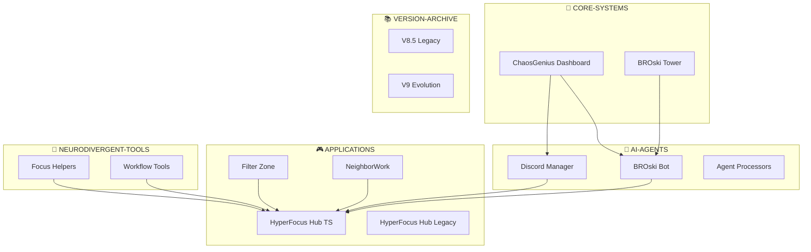

# 🧱 ARCHITECTURE OVERVIEW

This document outlines the unified architecture of the HYPERFOCUS UNIFIED EMPIRE.

## 🏗️ System Layers

| Layer                      | Purpose                         | Contents                                   | Dependencies     |
| -------------------------- | ------------------------------- | ------------------------------------------ | ---------------- |
| **🚀 CORE-SYSTEMS**         | Mission-critical infrastructure | ChaosGenius Dashboard, BROski Tower        | Foundation layer |
| **🤖 AI-AGENTS**            | Autonomous automation           | Trading bots, Discord managers, processors | Core Systems     |
| **🎮 APPLICATIONS**         | User-facing tools               | Hubs, filters, collaboration tools         | Core + Agents    |
| **🧠 NEURODIVERGENT-TOOLS** | ADHD-optimized features         | Focus aids, workflow helpers               | All layers       |
| **📚 VERSION-ARCHIVE**      | Historical preservation         | V8.5, V9 legacy systems                    | Independent      |
| **🛠️ DEVELOPMENT**          | Build & deployment              | CI/CD, tooling, configs                    | Meta layer       |
| **📖 DOCUMENTATION**        | Knowledge base                  | Guides, APIs, decisions                    | Meta layer       |

## 🌐 Component Relationships



## 🔄 Data Flow Architecture

### Message Bus Pattern
```
🤖 AI-AGENTS ←→ 📡 Message Bus ←→ 🚀 CORE-SYSTEMS
      ↕                               ↕
🎮 APPLICATIONS ←→ 🧠 NEURODIVERGENT-TOOLS
```

### Event-Driven Communication
- **Trading Events**: BROski Tower → BROski Bot → Discord Manager
- **User Actions**: Applications → Core Systems → Agents  
- **Focus Events**: Neurodivergent Tools → All Components
- **System Events**: Development Tools → All Layers

## 🏛️ Architectural Principles

### 1. **Neurodivergent-First Design**
- **Visual Organization**: Emoji-based navigation for quick recognition
- **Cognitive Load Reduction**: Clear separation of concerns
- **Single Command Workflows**: Minimize context switching
- **Historical Reference**: Easy access to evolution and decisions

### 2. **Modular Composition**
- **Loose Coupling**: Components communicate via well-defined interfaces
- **High Cohesion**: Related functionality grouped logically
- **Independent Deployment**: Each layer can be updated separately
- **Shared Dependencies**: Common utilities in development layer

### 3. **Evolution-Friendly**
- **Backward Compatibility**: Legacy versions preserved and accessible
- **Migration Paths**: Clear upgrade routes between versions
- **History Preservation**: Full git lineage maintained
- **Future Extensibility**: Architecture supports new components

## 🔧 Technical Stack

### Core Technologies
- **Languages**: Python, TypeScript, JavaScript, Bash
- **Frameworks**: Flask, Express, React, Discord.py
- **Databases**: SQLite, Redis, File-based stores
- **Infrastructure**: Docker, Docker Compose, GitHub Actions

### Integration Patterns
- **API Gateway**: Unified entry point for external requests
- **Service Mesh**: Internal service-to-service communication  
- **Event Sourcing**: State changes as immutable events
- **CQRS**: Separate read/write models for complex workflows

## 🛡️ Security Architecture

### Authentication & Authorization
- **Unified Auth**: Single sign-on across all applications
- **Role-Based Access**: Different permissions for different tools
- **API Security**: Token-based authentication for agents
- **Environment Isolation**: Clear separation of dev/staging/prod

### Data Protection
- **Sensitive Data**: Encrypted storage for trading keys, tokens
- **Audit Logging**: Full trail of system interactions
- **Backup Strategy**: Automated backups of critical data
- **Privacy Controls**: User data handling compliance

## 📊 Monitoring & Observability

### System Health
- **Application Metrics**: Performance, uptime, error rates
- **Business Metrics**: Trading performance, user engagement
- **Infrastructure Metrics**: Resource usage, capacity planning
- **Custom Dashboards**: Neurodivergent-friendly visualizations

### Alerting Strategy
- **Critical Alerts**: Immediate notification for system failures
- **Performance Alerts**: Proactive warnings for degradation
- **Business Alerts**: Trading losses, unusual activity patterns
- **Focus-Friendly**: Non-overwhelming notification design

## 🚀 Deployment Architecture

### Development Environment
```
📁 Local Development
├── 🐳 Docker Compose (all services)
├── 🔄 Hot Reloading (file watching)
├── 🧪 Testing Environment (isolated)
└── 📊 Debug Dashboard (unified logs)
```

### Production Environment
```
☁️ Cloud Infrastructure
├── 🚀 Core Services (high availability)
├── 🤖 Agent Workers (scalable)
├── 🎮 Web Applications (CDN)
├── 📊 Monitoring Stack (observability)
└── 🔒 Security Layer (auth, encryption)
```

## 🔮 Future Enhancements

### Planned Improvements
- **GraphQL API**: Unified data access layer
- **Micro-frontend Architecture**: Modular UI components
- **AI/ML Pipeline**: Enhanced automation and insights
- **Mobile Applications**: Native iOS/Android apps
- **Voice Interface**: Accessibility and hands-free operation

### Scalability Considerations
- **Horizontal Scaling**: Service-based architecture
- **Caching Strategy**: Multi-layer caching for performance
- **Database Sharding**: Partition large datasets
- **CDN Integration**: Global content delivery
- **Edge Computing**: Reduce latency for real-time features

---

*This architecture evolves with your empire. Each decision is logged in the [Consolidation Log](CONSOLIDATION-LOG.md).*
